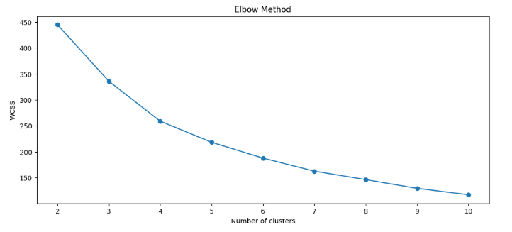
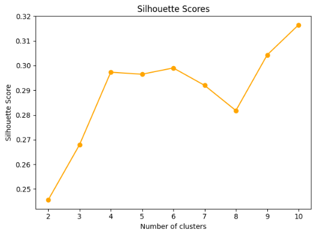
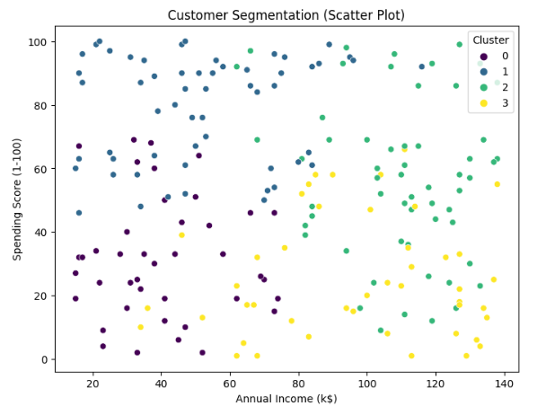
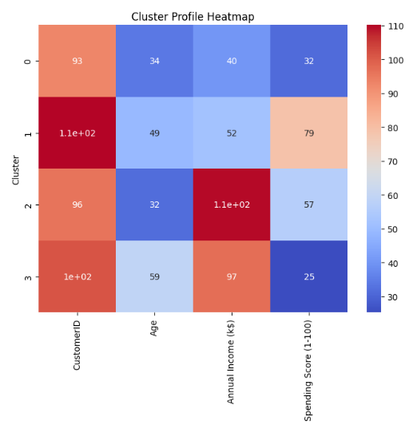

# K-Means Clustering for Customer Segmentation

[](https://www.python.org/)
[](https://scikit-learn.org/stable/)
[](https://seaborn.pydata.org/)
[](./LICENSE)
[](https://jupyter.org/)
[](https://www.kaggle.com/code/evangelosgakias/k-means-clust)

---

## 🚀 Live Results

You can view the notebook with all outputs and results on Kaggle:
[https://www.kaggle.com/code/evangelosgakias/k-means-clust](https://www.kaggle.com/code/evangelosgakias/k-means-clust)

All metrics, plots, and outputs are available in the linked Kaggle notebook for full transparency and reproducibility.

---

## 📑 Table of Contents
- [Live Results](#-live-results)
- [Table of Contents](#-table-of-contents)
- [Overview](#-overview)
- [Project Structure](#-project-structure)
- [Features](#-features)
- [Quickstart](#-quickstart)
- [Usage](#-usage)
- [Results](#-results)
- [Limitations and Future Work](#-limitations-and-future-work)
- [Contributing](#-contributing)
- [License](#-license)
- [Contact](#-contact)

---

## 📝 Overview

This project presents a comprehensive machine learning workflow for **K-Means Clustering** on a synthetic customer dataset. The notebook demonstrates:
- End-to-end data science best practices (EDA, preprocessing, clustering, evaluation, and interpretation)
- Professional documentation, accessibility, and reproducibility standards

**Goal:** Segment customers into meaningful groups based on their demographic and spending behavior, using K-Means clustering and visualizing the results with various plots.

---

## 🏗️ Project Structure
```
K-Means Clustering/
├── K_Means_Clust.ipynb         # Jupyter notebook with the complete implementation
├── requirements.txt            # Python dependencies
├── LICENSE                    # MIT License file
├── README.md                   # Project documentation (this file)
└── figures/                    # Result images and plots
    ├── elbow_method.png
    ├── silhouette_scores.png
    ├── customer_segmentation.png
    └── cluster_profile_heatmap.png
```

---

## 🚦 Features

### Data Preparation
- **Synthetic Dataset:** Generates a customer dataset (200 samples, 3 features: Age, Annual Income, Spending Score)
- **Exploratory Data Analysis (EDA):** Statistical summaries, pairplots, and feature distribution analysis
- **Preprocessing:**
  - Feature scaling (StandardScaler)
  - Handling missing values (demonstrated, though synthetic data has none)

### Clustering & Evaluation
- **K-Means Clustering:**
  - scikit-learn implementation
  - Elbow Method for optimal cluster selection
  - Silhouette Score for cluster quality

### Visualization & Analysis
- **Visualizations:**
  - Pairplots and heatmaps
  - Scatter plots of clusters
  - Elbow and silhouette plots
- **Interpretation:**
  - Discussion of cluster structure and business implications

---

## ⚡ Quickstart

1. **Kaggle (Recommended for Reproducibility):**
   - [Run the notebook on Kaggle](https://www.kaggle.com/code/evangelosgakias/k-means-clust)
2. **Local:**
   - Clone the repo and run `K_Means_Clust.ipynb` in Jupyter after installing requirements.

---

## 💻 Usage

1. **📥 Clone the repository:**
   ```bash
   git clone https://github.com/EvanGks/k-means-clustering-synthetic-dataset.git
   cd k-means-clustering-synthetic-dataset
   ```
2. **🔒 Create and activate a virtual environment:**
   - **Windows:**
     ```bash
     python -m venv .venv
     .venv\Scripts\activate
     ```
   - **macOS/Linux:**
     ```bash
     python3 -m venv .venv
     source .venv/bin/activate
     ```
3. **📦 Install dependencies:**
   ```bash
   pip install -r requirements.txt
   ```
4. **🚀 Launch Jupyter Notebook:**
   ```bash
   jupyter notebook K_Means_Clust.ipynb
   ```
5. **▶️ Run all cells** to reproduce the analysis and results.

**🛠️ Troubleshooting:**
- If you encounter missing package errors, ensure your Python environment is activated and up to date.
- For best reproducibility, use the provided Kaggle link.

---

## 📊 Results

### Model Metrics
- **Elbow Method:** The clustering quality was evaluated using the Elbow Method, which plots the within-cluster sum of squares (WCSS) for different values of k. The optimal number of clusters was determined at the 'elbow' point.
  
  

- **Silhouette Scores:** The Silhouette Score was calculated for each k to assess the quality of clustering. The highest silhouette score further validated the optimal cluster choice.
  
  

### Visualizations
- **Customer Segmentation (Scatter Plot):** Customers are visualized in the feature space (Annual Income vs. Spending Score), colored by their assigned cluster. This plot demonstrates clear separation between customer segments.
  
  

- **Cluster Profile Heatmap:** The heatmap displays the average feature values for each cluster, providing insight into the characteristics of each customer segment.
  
  

### Key Findings
- The optimal number of clusters was found to be **4**, based on both the Elbow Method and Silhouette Score.
- The analysis identified distinct customer segments, such as high-income/high-spending and low-income/low-spending groups.
- Visualizations support the interpretability and business value of the segmentation, enabling targeted marketing strategies and personalized customer engagement.

*For full details, metrics, and plots, see the [notebook](https://www.kaggle.com/code/evangelosgakias/k-means-clust).*

---

## 📝 Limitations and Future Work

- **Synthetic Data:** The current dataset is synthetic; results may differ with real-world data.
- **Cluster Interpretability:** K-Means assumes spherical clusters and equal variance, which may not always hold.
- **Feature Engineering:** Additional features could improve segmentation quality.
- **Algorithm Comparison:** Future work could compare K-Means with other clustering algorithms (e.g., Hierarchical, DBSCAN).
- **Deployment:** Potential to deploy as a web app for interactive exploration.

---

## 🤝 Contributing

Contributions are welcome! Please feel free to submit a Pull Request. For major changes, please open an issue first to discuss what you would like to change.

---

## 📝 License

This project is licensed under the MIT License. See the [LICENSE](./LICENSE) file for details.

---

## 📬 Contact

For questions or feedback, please reach out via:
- **GitHub:** [EvanGks](https://github.com/EvanGks)
- **X (Twitter):** [@Evan6471133782](https://x.com/Evan6471133782)
- **LinkedIn:** [Evangelos Gakias](https://www.linkedin.com/in/evangelos-gakias-346a9072)
- **Kaggle:** [evangelosgakias](https://www.kaggle.com/evangelosgakias)
- **Email:** [vgakias_@hotmail.com](mailto:vgakias_@hotmail.com)


---

Happy Clustering!